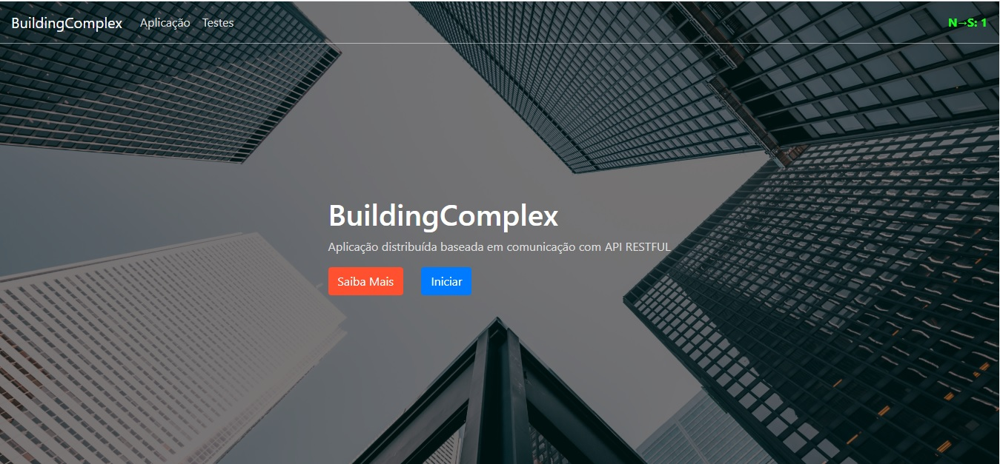

# building-complex-fe

Trata-se de uma aplicação que visa simular um complexo de edifícios, de modo que para a entrada em qualquer edifício, o usuário deve
informar o nível de acesso em questão e suas credenciais. O tipo das credenciais depende exclusivamente do nível do acesso, ou seja, não é necessário
que o usuário informe uma senha se o nível de acesso em questão é visitante, entretanto, deve informar além do e-mail, uma senha no caso de
possuir o nível de acesso de funcionário.

  </img>

